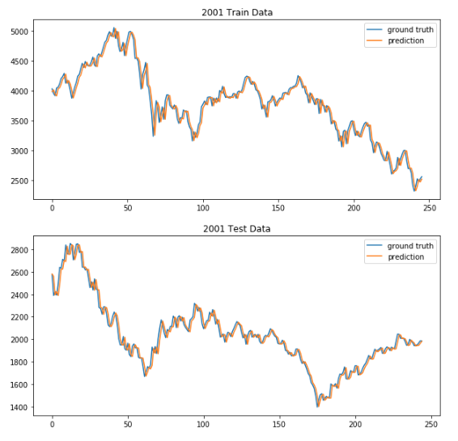
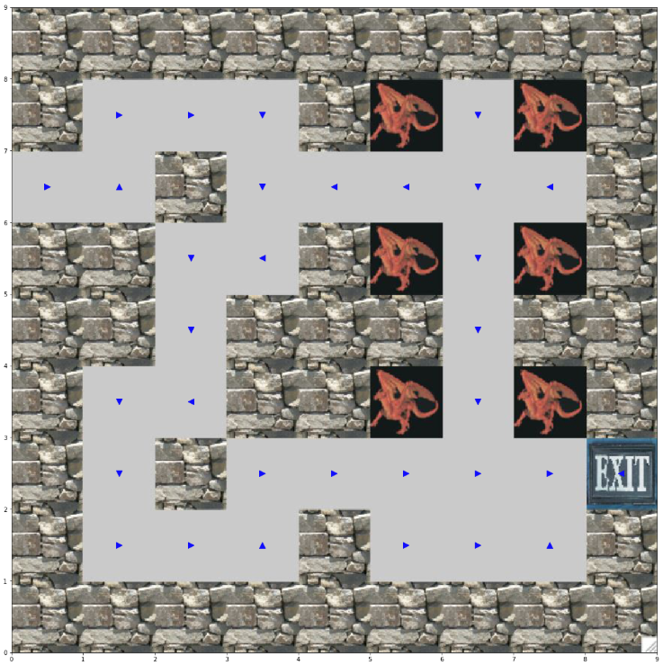

# CSE_250A: Probabilistic Reasoning and Decision-Making

HW4: Statistical Language Modeling and Sequences

<kbd>
  
</kbd>

                                                                               

HW5: Handwritten Digit Classification

HW6: Expectation Maximization and Auxiliary Functions

HW8: Recommender System

HW9: Reinforcement Learning - Policy and Value Iteration

<kbd>
  
</kbd>

                                                                               

