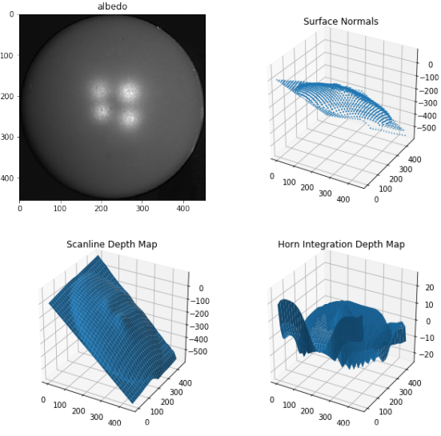

# CSE_252A: Intro to Computer Vision

- HW2: Homography and Rendering

<kbd>
  
</kbd>

      

- HW3: Photo-Stereo

<kbd>
  
</kbd>

      

- HW4: Corner Detection and Epipolar Geometry

<kbd>
  
</kbd>

      

- HW5: Optical Flow

<kbd>
  
</kbd>

      

